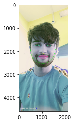

# facial
Facial Keypoints Detection
Built a system to detect 68 distinguished keypoints; Consists of  Haar Cascade algorithm for detection of faces and textbf CNN architecture for keypoints prediction.

Trained on images from YouTube Faces DataBase by employing
Transfer Learning on Resnet-18 model Used Pytorch and OpenCV.
Files included in this repository are all .ipynb files.

1_preprocessing.ipynb
In this notebook,I prerpocessed the images and transformed into modelling form with custome classes based on  Pytorch's "DATALOADER","TRANSFORMS" class.

2-architecture and modellingipynb
Created whole pipeline for transformed to dataset into modeeling input form then modelled with resnet.

3-final pipelineipynb
takes any image as input,extracts the faces using Har Cascade classifier and the predicts keypoints on those faces.

4-evaulaation.ipynb

5-fun.ipynb and experiment.ipynb
experiments and put glass on the image using predicted keypoimts.

Here is How the result on my own photos. Pretty decent!!

